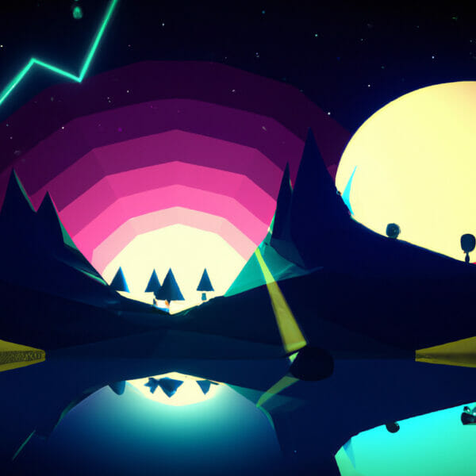

<div align="center">

# DODGE IT

### A neon arcade survival game about movement, timing, and falling fire.



<br />

[](https://www.python.org/)
[](https://www.pygame.org/)
[](#quick-start)

</div>

---

## What Is Dodge It?

**Dodge It** is a Pygame survival game with a simple rule: keep moving and do not get hit.

Meteors fall from above with different sizes, speeds, and animated fire trails. Choose the challenge before each run, earn score over time, spend it on upgrades, and use the pause or menu controls when you need a reset.

The game is intentionally small, readable, and hackable. Every major responsibility lives in its own package so new mechanics can be added without turning the main loop into a knot.

## Quick Start

### Requirements

- Python 3.10 or newer
- Pygame 2.x

### Install

```bash
python -m pip install pygame
```

### Run

Run from the repository root so the relative asset paths resolve correctly:

```bash
python main.py
```

Windows users can also use:

```powershell
py main.py
```

The game opens on the difficulty menu. Choose a mode with `1`, `2`, or `3`.

## Controls

| Action | Key |
| --- | --- |
| Choose Easy | `1` |
| Choose Medium | `2` |
| Choose Hard | `3` |
| Move left / right | `A` / `D` |
| Open upgrades | `U` |
| Buy speed upgrade | `SHIFT` |
| Buy survivability upgrade | `CTRL` |
| Pause / resume | `P` |
| Return to main menu | `M` while paused or after death |
| Respawn | `ENTER` after the countdown |

## Difficulty And Scoring

Difficulty changes the entire rhythm of a run: meteor speed, meteor size range, spawn interval, and score gain.

| Mode | Meteor behavior | Score rate |
| --- | --- | ---: |
| **Easy** | Slower, larger timing windows | `0.75x` |
| **Medium** | Balanced default challenge | `1.0x` |
| **Hard** | Faster, denser, less forgiving | `1.5x` |

The score is based on survival time multiplied by the selected difficulty rate. Hard is not only harder; it rewards cleaner play.

## Upgrades

Open the upgrade panel with `U`. Each upgrade costs **100 score** and can be bought once for the current player profile.

| Upgrade | Key | Effect |
| --- | --- | --- |
| Speed Boost | `SHIFT` | Increases horizontal movement speed. |
| Reinforced Suit | `CTRL` | Lets the player survive one additional meteor hit. |

Purchased upgrades survive a respawn and returning to the menu. A new run resets the score and current hit counter, but not the player profile upgrades.

## Run Flow

```text
Main Menu
   |
   |  choose 1 / 2 / 3
   v
Active Run
   |
   |  pause with P, return with M
   |  buy upgrades with U
   v
Game Over
   |
   |  wait for the respawn countdown
   |  ENTER -> new run
   |  M     -> main menu
   v
Main Menu
```

A meteor that misses the player creates a short ground-debris burst. A meteor that hits the player triggers an impact effect and consumes one hit.

## Lifetime Statistics

The game stores long-term progress in the root-level `stats.json` file. It is updated when a run ends.

Tracked values include:

- total completed runs
- best score
- total score
- total hits taken
- speed upgrades purchased
- survivability upgrades purchased
- completed runs by difficulty

The file is plain JSON, so it is easy to inspect, back up, or reset. To reset lifetime progress, replace its contents with the default structure already committed in the repository.

## Project Architecture

```text
DodgeIT/
├── main.py                    # Small application launcher
├── stats.json                 # Persistent lifetime statistics
├── README.md                  # Project documentation
├── assets/
│   ├── meteor/                # Meteor animation frames
│   ├── player/                # Idle, left, and right player sheets
│   └── vfx/                   # Fire, explosion, and debris assets
└── src/
    └── dodgeit/
        ├── game.py            # Session orchestration and state machine
        ├── config/
        │   └── settings.py    # Display, timing, difficulty, and asset config
        ├── entities/
        │   ├── player.py      # Movement, animation, hits, and upgrades
        │   └── obstacles.py   # Meteor spawning, scaling, and movement
        ├── systems/
        │   ├── effects.py     # Cached VFX and ground debris
        │   ├── stats.py       # JSON loading and lifetime-stat persistence
        │   └── upgrades.py    # Upgrade purchase rules
        └── ui/
            └── render.py      # HUD, menus, overlays, and drawing helpers
```

### Why This Layout?

- `entities` owns objects that exist in the game world.
- `systems` owns cross-cutting behavior and persistence.
- `ui` owns everything that draws to the window.
- `config` keeps tuning values in one place.
- `game.py` coordinates the systems without owning every implementation detail.
- `main.py` stays intentionally boring: initialize Pygame, run the game, quit.

## Performance

The game avoids expensive work inside the frame loop wherever possible:

- meteor sprites are cached by rendered size
- VFX sheets are decoded and scaled once per effect size
- debris textures are cached and reused
- HUD fonts are created once
- the game only updates active effects and active meteors

If you add a new effect, prefer loading and preparing its frames once, then reuse them during gameplay.

## Assets And Credits

- Player and meteor artwork: project assets
- Background artwork: project asset
- VFX sprites: Brackeys VFX Bundle

Please preserve the original third-party asset license and credit information when redistributing the project.

## Troubleshooting

### The game cannot find an image

Run the command from the repository root:

```bash
python main.py
```

The project intentionally uses repository-relative asset paths.

### The game feels slow

Use a recent Python version and avoid opening very large image editors or additional Pygame windows. The runtime already caches the expensive sprite preparation work.

### Lifetime stats look wrong

Close the game before manually editing `stats.json`. The file is rewritten when a completed run is recorded.

---

<div align="center">

**Choose your difficulty. Find your rhythm. Keep moving.**

</div>
